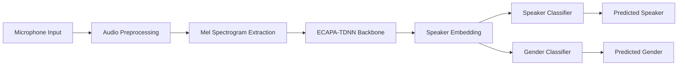

# 🎤 Real-Time Speaker & Gender Identification using ECAPA-TDNN

## 🚀 About This Project

This project is a real-time speaker and gender identification system built using the ECAPA-TDNN deep learning architecture.  

It captures live audio from a microphone, processes it in real time, and predicts:
- Who is speaking (Speaker Identification)
- The speaker’s gender (Gender Classification)

The entire system is built using PyTorch and designed to be modular, efficient, and easy to extend.

---

## ✨ Why I Built This

I wanted to explore practical audio AI systems beyond theory.  
Instead of just training a model, I implemented a complete real-time pipeline that:

- Takes live microphone input
- Processes audio features
- Generates speaker embeddings
- Performs classification instantly

This project helped me understand:
- Audio preprocessing
- Deep learning for speech tasks
- Real-time inference systems
- Model deployment workflows

---

## 🧠 How It Works



### 🔎 Step-by-Step Pipeline

1. The microphone captures live audio.
2. The audio is cleaned and normalized.
3. Mel Spectrogram features are extracted.
4. The ECAPA-TDNN model generates a speaker embedding.
5. The embedding is passed to:
   - A speaker classification head
   - A gender classification head
6. Predictions are displayed in real time.

---

## 🛠 Technologies Used

- Python  
- PyTorch  
- Torchaudio  
- NumPy  
- SoundDevice  
- HuggingFace (Pretrained ECAPA models)

---

## 📂 Project Structure

```
voice-gender-classifier/
│
├── model.py            # ECAPA model & classifiers
├── test.py             # Real-time inference script
├── requirements.txt    # Project dependencies
├── README.md
└── data/               # Audio samples (if used)
```

---

## 💻 Installation

```bash
git clone https://github.com/pavanghorpade60/ecapa-realtime-speaker-gender.git
cd ecapa-realtime-speaker-gender
pip install -r requirements.txt
```

---

## ▶️ Run the System

```bash
python test.py
```

Speak into your microphone and view predictions in real time.

---

## 📊 Results

- Real-time gender prediction with stable accuracy  
- Speaker recognition using learned embeddings  
- Low-latency inference suitable for live applications  

---

## 🔮 Future Improvements

- Unknown speaker detection
- Larger multi-speaker dataset
- Confidence score display
- Web app deployment (Streamlit / FastAPI)
- REST API version for integration

---

## 👨‍💻 Author

**Pavan Ghorpade**  
Machine Learning & AI Enthusiast  

This project is part of my journey into building practical, real-world AI systems.

---

⭐ If you found this interesting, feel free to star the repository!
